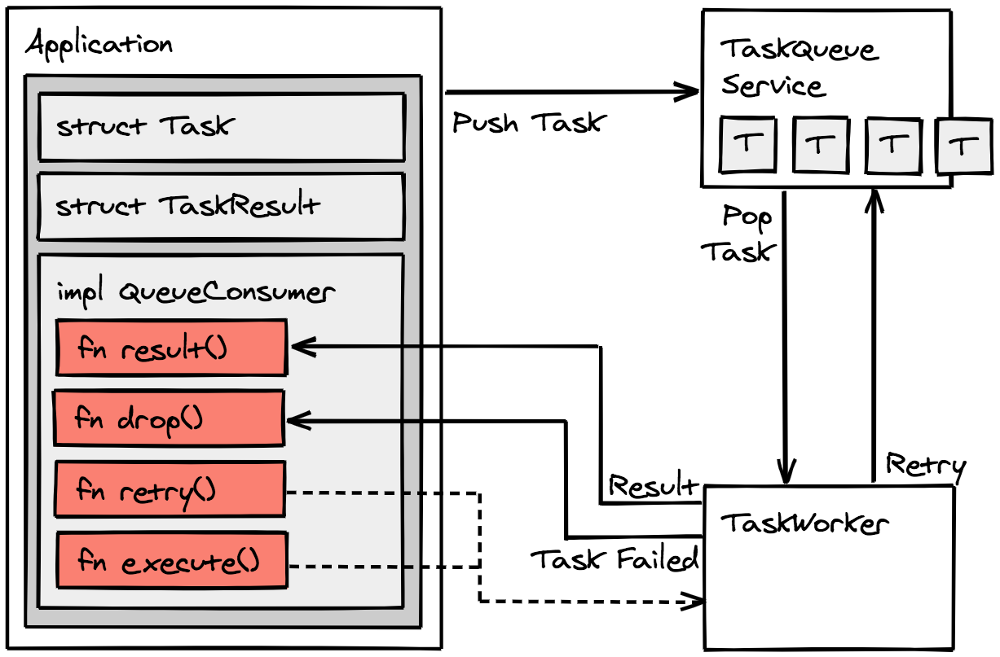

# Actix Task Queue

Actix Task Queue is a generic task queue service. You have many different task queue for many
different pair of Task and Task Result in your application as possible.

A task queue for a pair of Task and Task Result will be a [SystemService](https://docs.rs/actix/latest/actix/registry/trait.SystemService.html).



To use the queue, you first need to define a data structure for your Task and Task Result:

For example:
```
#[derive(Debug, Default, Clone, Copy)]
struct Task(i32);
struct TaskResult(i32);
```

Next, you need to implement the `QueueConsumer` trait for your pair of Task and Task Result:

```
#[async_trait]
impl QueueConsumer<Task, TaskResult> for TaskWorker<Task, TaskResult> {
    async fn execute(&self, task: Task) -> Result<TaskResult, WorkerExecuteError> {
      ...
    }

    fn get_queue(&self) -> Addr<TaskQueue<Task>> {
      ...
    }

    fn retry(&self, task: Task) -> Task {
      ...
    }

    fn drop(&self, task: Task) {
      ...
    }

    fn result(&self, result: TaskResult) {
      ...
    }
}
```

When you need to run the next available task in the queue, call the `next()` method of
your task worker.

```
worker.next().await
```

This method will return a `Result<TaskResult, WorkerExecuteError>`.

---

The following example describe a task queue of `i32` numbers, when executing, the worker will:

- If a number is larger or equal to 5, add 5 to that number.
- If a number is larger than 0 but smaller than 5, add 1 to that number and send it back to the queue to retry.
- If a number is smaller than 0, drop that number from the queue.

```
#[derive(Debug, Default, Clone, Copy)]
struct PlusFive(i32);
struct PlusFiveResult(i32);

#[async_trait]
impl QueueConsumer<PlusFive, PlusFiveResult> for TaskWorker<PlusFive, PlusFiveResult> {
    async fn execute(&self, task: PlusFive) -> Result<PlusFiveResult, WorkerExecuteError> {
        let PlusFive(n) = task;
        if n >= 5 {
            return Ok(PlusFiveResult(n + 5));
        } else if n > 0 {
            return Err(WorkerExecuteError::Retryable);
        } else {
            return Err(WorkerExecuteError::NonRetryable);
        }
    }

    fn get_queue(&self) -> Addr<TaskQueue<PlusFive>> {
        TaskQueue::<PlusFive>::from_registry()
    }

    fn retry(&self, task: PlusFive) -> PlusFive {
        let PlusFive(n) = task;
        println!("RETRYING VALUE = {}", n);
        PlusFive(n + 1)
    }

    fn drop(&self, task: PlusFive) {
        let PlusFive(n) = task;
        println!("DROPPED TASK WITH VALUE = {}", n);
    }

    fn result(&self, result: PlusFiveResult) {
        let PlusFiveResult(n) = result;
        println!("RESULT = {}", n);
    }
}

#[actix_rt::main]
async fn main() {
    let queue = TaskQueue::<PlusFive>::from_registry();
    let worker = TaskWorker::<PlusFive, PlusFiveResult>::new();

    queue.do_send(Push::new(PlusFive(5)));
    queue.do_send(Push::new(PlusFive(8)));
    queue.do_send(Push::new(PlusFive(3)));
    queue.do_send(Push::new(PlusFive(11)));
    queue.do_send(Push::new(PlusFive(0)));
    queue.do_send(Push::new(PlusFive(20)));

    worker.next().await;
    worker.next().await;
    worker.next().await;
    worker.next().await;
    worker.next().await;
    worker.next().await;
    worker.next().await;
    worker.next().await;
    worker.next().await;
    worker.next().await;
}

```